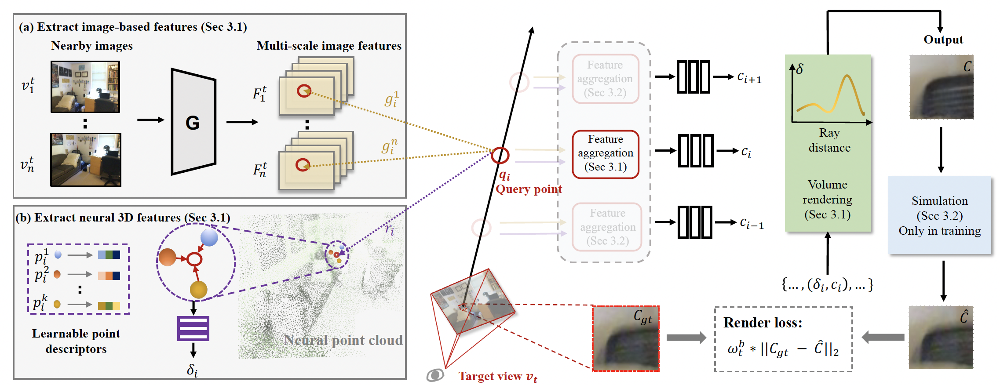
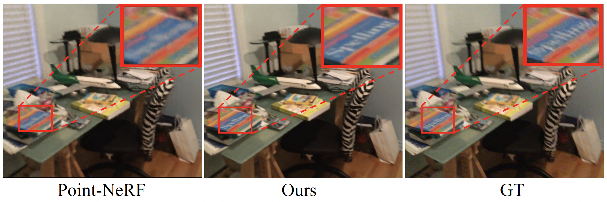

# Hybrid Neural Rendering for Large-Scale Scenes with Motion Blur

**Hybrid Neural Rendering for Large-Scale Scenes with Motion Blur** (CVPR 2023)  
[Peng Dai*](https://github.com/daipengwa), [Yinda Zhang*](https://www.zhangyinda.com/), [Xin Yu](https://scholar.google.com/citations?user=JX8kSoEAAAAJ&hl=zh-CN), [Xiaoyang Lyu](https://scholar.google.com/citations?user=SF7bq48AAAAJ&hl=zh-CN), [Xiaojuan Qi](https://scholar.google.com/citations?user=bGn0uacAAAAJ&hl=en).
<br>[Paper](), [Project_page](https://daipengwa.github.io/Hybrid-Rendering-ProjectPage/)


## Introduction

<br>
Our method takes advantages of both neural 3D representation and image-based rendering to render high-fidelity and temporally consistent results. 
Specifically, the image-based features compensate for the defective neural 3D features, and the neural 3D features boost the temporal consistency of image-based features.
Moreover, we propose efficient designs to handle motion blurs that occur during capture.

## Environment
* We use the same environment as PointNeRF, please follow their [installation](https://github.com/Xharlie/pointnerf) step by step. (conda virtual environment is recommended) 

* Install the dependent python libraries
```Shell
pip install opencv_python imutils
```

The code is running on a single NVIDIA 3090 GPU. 


## Data Preparation
Please download [datasets]() used in this paper. The layout looks like this:
```
HybridNeuralRendering
├── data_src
    ├── nerf
    │   │   │──nerf_synthetic
    |   │   │   │──chair
    |   │   │   │──lego
    ├── scannet
    |   │   │──frame_weights_step5 
    │   │   │──scans 
    |   |   │   │──scene0101_04
    |   │   │   │──scene0241_01
    |   │   │   │──livingroom
    |   │   │   │──vangoroom
```

## Quality-aware weights
Please follow the [RAFT](https://github.com/princeton-vl/RAFT) to build the running environment and download the pre-trained model.
To compute quality-aware weights, run:
```Shell
python demo_pointnerf_train.py --model=models/raft-things.pth --path=path of RGB images  --ref_path=path of RGB images  --scene_name=scene name
```

Alternatively, you can directly download the [pre-computed weights]().

## Train
We take the training on ScanNet 'scene0241_01' for example:
### Hybrid rendering
Only use hybrid rendering, run:
```Shell
bash ./dev_scripts/w_scannet_etf/scene241_hybrid.sh
```

### Hybrid rendering + blur-handling module (pre-defined blur kernels)
The full version of our method, run:
```Shell
bash ./dev_scripts/w_scannet_etf/scene241_full.sh
```

### Hybrid rendering + blur-handling module (learned blur kernels)
Instead of using pre-defined kernels, we also provide an efficient way to estimate blur kernels from rendered and GT patches.
```Shell
bash ./dev_scripts/w_scannet_etf/scene241_learnable.sh
```

## Evaluation
We take the evaluation on ScanNet 'scene0241_01' for example:</br>
Please specify "name" in "scene241_test.sh" to evaluate different experiments, then run:
```Shell
bash ./dev_scripts/w_scannet_etf/scene241_test.sh
```
Alternatively, you can evaluate using the [pre-trained models]().
## Results
Our method generates high-fidelity results when comparing with PointNeRF' results and reference images.
Please visit our [project_page](https://daipengwa.github.io/Hybrid-Rendering-ProjectPage/) for more comparisons.
</br>
</br>


## Contact
If you have questions, you can email me (daipeng@eee.hku.hk).

## Citation
If you find this repo useful for your research, please consider citing our paper:
```
@inproceedings{dai2022hybrid,
  title={Hybrid Neural Rendering for Large-Scale Scenes with Motion Blur},
  author={Dai, Peng and Zhang, Yinda and Yu, Xin and Lyu, Xiaoyang and Qi, Xiaojuan},
  booktitle={Proceedings of the IEEE/CVF Conference on Computer Vision and Pattern Recognition},
  year={2023}
}
```

# Acknowledgement
This repo is heavily based on [PointNeRF](https://github.com/Xharlie/pointnerf) and [RAFT](https://github.com/princeton-vl/RAFT), we thank authors for their brilliant works.
